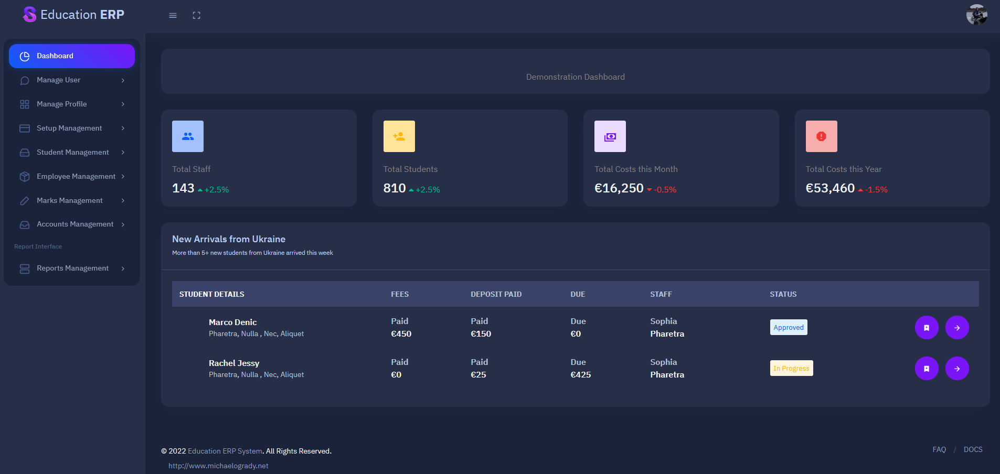
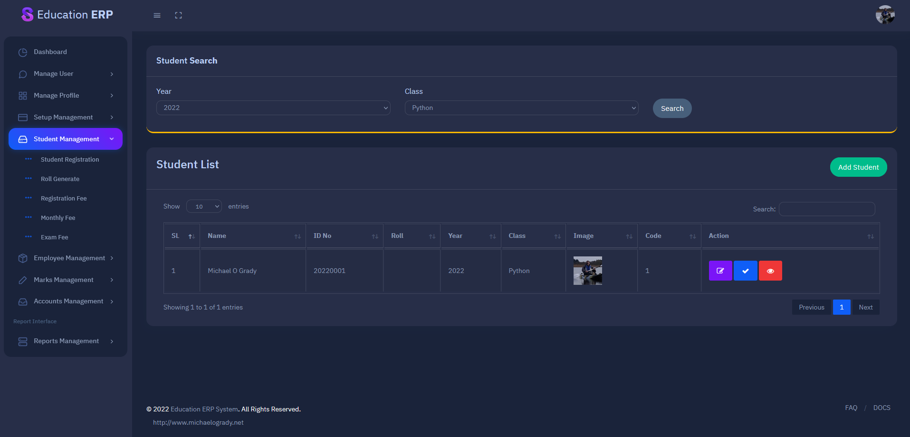
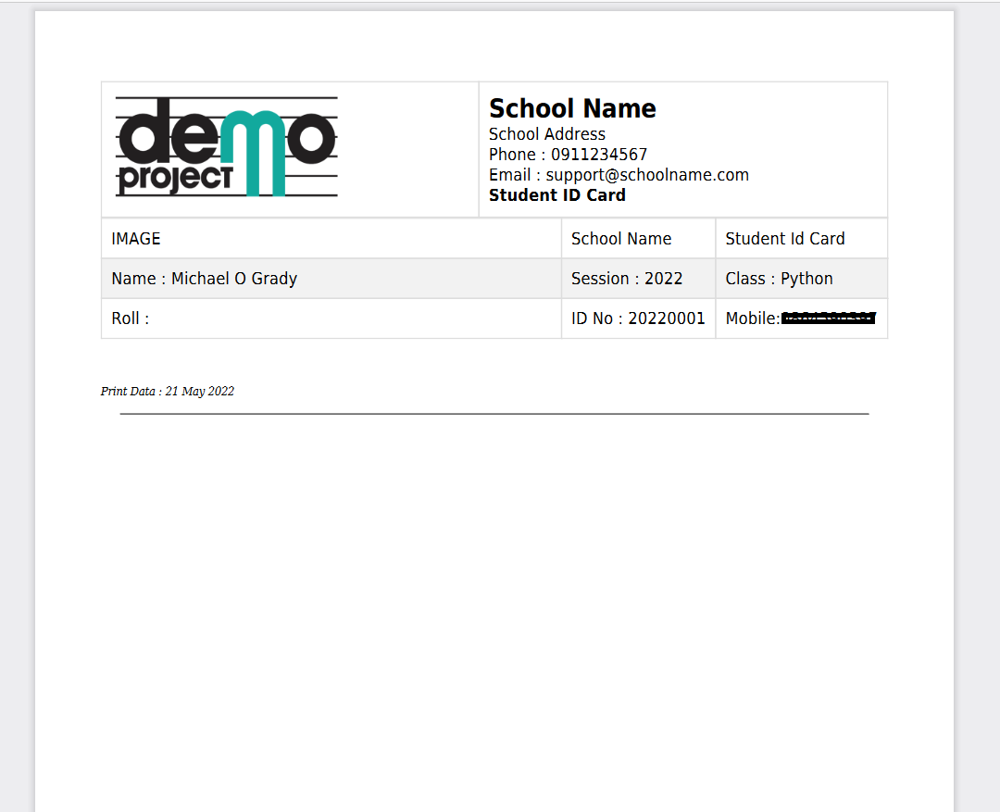

<h1 align="center">Education ERP System - Laravel 8 CMS Project</h1>
<p align="center"><a href="https://laravel.com" target="_blank"></a></p>
<p align="center"></p>
<p align="center"></p>
<p align="center"></p>
<p align="center"></p>

---

# Introduction

Education is an ERP System offering a complete school management system with staff, student expenses and report management functionality. The Application is built in Laravel 8 and is a complete end-to-end CMS (Content Management System) and is highly customizable. The initial project is a starter project with lots of room for improvement in terms of features and functionality that can be built upon. Multi authentication system built using Laravel Jetstream with User and Admin logins.

# Link to Project

> Hosted on Heroku on a ClearDB MySQL Database, using JetBrains DataGrip to connect to the database.

-   [https://education-erp.herokuapp.com/](https://education-erp.herokuapp.com/)

# Developer Notes

Prior to deploying the application the following considerations need apply.

-   Configuration Caching
    -   To give your application a speed boost, you should cache all of your configuration files into a single file using the config:cache Artisan command. This will combine all of the configuration options for your application into a single file which can be quickly loaded by the framework. [See here](https://laravel.com/docs/9.x/configuration#configuration-caching)
    -   Run:
        -   `php artisan config:cache`
-   Application cache
    -   The application cache is the primary cache in Laravel. It stores everything that you manually cache in your application. You can clear only specific elements of the cache if you use tags or different cache stores. The easiest way to clear the Laravel cache is via artisan:
    -   Run:
        -   `php artisan cache:clear`
-   View cache
    -   Another part of the application that has a cache is the view cache. The view cache stores rendered Blade templates to speed up your application. You can manually render all views to increase the performance by using the artisan command for it:
    -   Run:
        -   `php artisan view:clear`

# Instructions to run project locally

1. Download/Clone Project
2. Run `composer install` within the project directory to install dependencies for the project (ensure composer is installed on your system)
3. Create the `education_erp` database within phpMyAdmin Panel
4. Run `php artisan migrate:fresh` to migrate the database
5. Rename `env.example` to `.env` (sample environment variables for Laravel) and populate with your details:
    1. Set up a [mailtrap account](https://mailtrap.io/) to enable reset password, and confirm account functionality. **Required Step**.
    2. Populate the file with the details from your mailtrap account.
6. Run `php artisan serve` to starting a Laravel development server on http://127.0.0.1:8000
7. Create an account
    1. Go into the phpMyAdmin panel and assign a usertype of `Admin` to your user record.

# Routes

-   Login to Dashboard `http://127.0.0.1:8000`

# Deploying on a Server

-   Compress the project folder by adding to a .zip directory for uploading to the server and extracting.
-   Create a MySQL database with your hosting provider and import the `education_erp.sql` file to create the tables and populate the data.
-   Update the database configuration in the `.env` file (e.g. database name, username, password etc.)
-   Errors?
    -   `Specified key was too long?`:
    -   `HTTPS Errors?`

Update the following in `AppServiceProvider.php` the code should be self explainatory.

```php
<?php

namespace App\Providers;

use Illuminate\Support\ServiceProvider;
use Illuminate\Support\Facades\Schema;
use Illuminate\Support\Facades\URL;

class AppServiceProvider extends ServiceProvider
{
    /**
     * Register any application services.
     *
     * @return void
     */
    public function register()
    {
        //
        Schema::defaultStringLength(191);
    }

    /**
     * Bootstrap any application services.
     *
     * @return void
     */
    public function boot()
    {
        //
        if(config('app.env') === 'production') {
            URL::forceScheme('https');
        }
    }
}
```

# Deploying on Heroku

> Credentials for this project are redacted for security reasons. Step-by-step instructions below.

-   [Heroku - Getting Started with Laravel](https://devcenter.heroku.com/articles/getting-started-with-laravel)

## Prepare Git

-   `git init`
-   `git add .`
-   `git commit -m "new laravel project"`

## Create a Procfile

This is required to tell Heroku where to serve the project from. i.e. with Laravel this must be from the public folder.

-   `echo "web: vendor/bin/heroku-php-apache2 public/" > Procfile`
-   `git add .`
-   `git commit -m "Procfile for Heroku"`

## Create Application

-   `heroku create`
    -   Set a Laravel encryption key
        -   `php artisan key:generate --show`
        -   `heroku config:set APP_KEY=<your_app_key_goes_here>`
-   Deploy
    -   `git push heroku master`

## Set up Database

-   Configure Add-ons
    -   Select `ClearDB MySQL`
        -   This will generate a MySQL database and generate credentials (connection string with database name, username, password) in Config Vars (`CLEARDB_DATABASE_URL`)

## Config Vars

| Key                  | Value                      |
| -------------------- | -------------------------- |
| APP_KEY              | \<your_app_key_goes_here>  |
| CLEARDB_DATABASE_URL | \<automatically_generated> |
| APP_DEBUG            | False                      |
| DB_CONNECTION        | mysql                      |
| DB_DATABASE          | \<database_name_goes_here> |
| DB_HOST              | \<host_goes_here>          |
| DB_PASSWORD          | \<password_goes_here>      |
| DB_PORT              | 3306                       |
| DB_USERNAME          | \<username_goes_here>      |
| APP_ENV              | production                 |

## Migrate the Tables

-   Settings
    -   Run Console
        -   `php artisan migrate:fresh`

## Connect to the Database

Use a tool such as [DataGrip](https://www.jetbrains.com/help/datagrip/meet-the-product.html) by JetBrains to connect to the Database remotely.

-   Create a user through the Admin Panel Login
    -   Update the record in the database and add `Admin` to the `usertype` field in the record to access admin features.

## Enforcing HTTPS for Production

-   Within `AppServiceProvider.php` inside the `boot` function add the following

```php
use Illuminate\Support\Facades\URL;

    public function boot()
    {
        //
        if(config('app.env') === 'production') {
            URL::forceScheme('https');
        }
    }
```

## Setting the Default String Length

If errors occur, add the following to the `register` function within the same file:

```php
use Illuminate\Support\Facades\Schema;
    public function register()
    {
        //
        Schema::defaultStringLength(191);
    }
```
